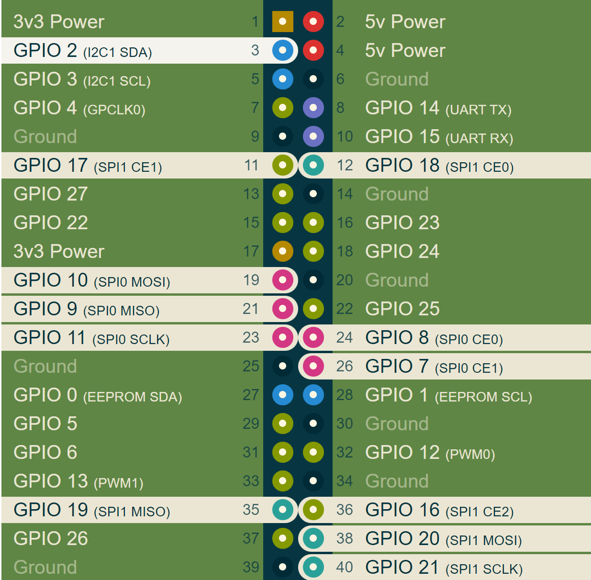

# MAX6675_Thermocouple_K_RS485CANHAT

## Wiring the PI
Please do the wiring as below with the image as refrence:
# wiring
```
    Raspberry         MAX6675
    GND     ------      GND
    5V      ------      VCC
   pin 23   ------      SCK
   pin 24   ------      CS
   pin 21   ------      SO
```


